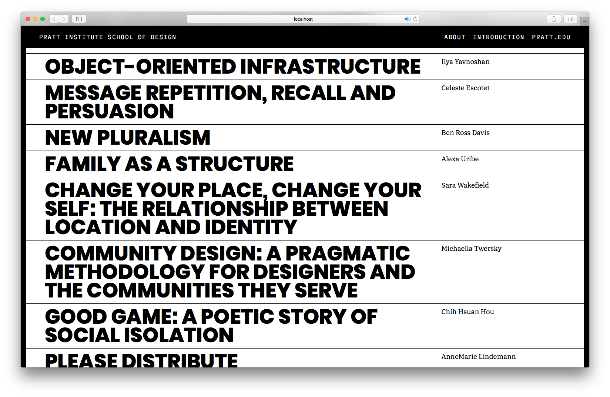

twenty-six designed and developed the site using Jekyll, an open source static site generator that allowed the students to submit their own content into a database that populated the site. This year's graduating class featured 46 thesis projects.

<section class="clear"></section>

In addition to showcasing student work, the site also provides information on the department curriculum, thesis requirements, and introductory letters from the department leads.

